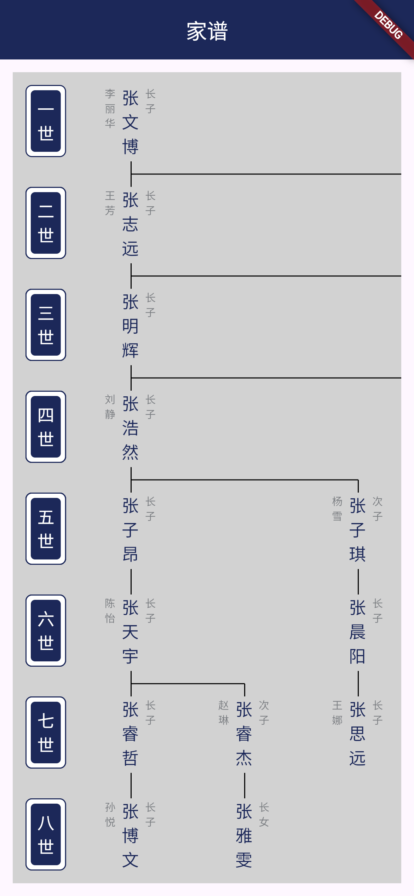

# JiaPu Widget

`jia_pu_widget` is a Flutter widget for rendering Chinese family tree (JiaPu) diagrams, supporting unlimited generations and members per generation, with fully customizable nodes and generation labels.



## Features

- **Unlimited Generations and Members**: Supports any depth of generations and any number of members per generation, with automatic node layout and no overlaps.
- **Customizable Nodes and Labels**: Customize nodes (name, spouse, order) and generation labels via `nodeBuilder` and `generationLabelBuilder`.
- **Node Interaction Support**: Nodes are user-defined `Widget`s, enabling click, long-press, and other interactive events for enhanced user experience.
- **Built-in Scrolling**: Supports horizontal and vertical scrolling for large family trees.
- **Interactive Support**: Add an external `InteractiveViewer` for zooming and panning, suitable for mobile and desktop devices.
- **Cross-Platform Support**: Compatible with Android, iOS, Web, Windows, macOS, Linux.

## Installation

Add the dependency to your `pubspec.yaml`:

```yaml
dependencies:
  jia_pu_widget: ^1.0.0
```

Run the following command to install:

```bash
flutter pub get
```

## Usage Example

Below is a simple family tree example demonstrating how to use `JiaPuWidget` with a click event on nodes:

```dart
import 'package:flutter/material.dart';
import 'package:jia_pu_widget/jia_pu_widget.dart';
import 'package:jia_pu_widget/models/jia_pu_member.dart';

void main() {
  runApp(const MyApp());
}

class MyApp extends StatelessWidget {
  const MyApp({Key? key}) : super(key: key);

  @override
  Widget build(BuildContext context) {
    return const MaterialApp(home: JiaPuPage());
  }
}

class JiaPuPage extends StatelessWidget {
  const JiaPuPage({Key? key}) : super(key: key);

  JiaPuMember buildFamilyTree() {
    return JiaPuMember(
      name: 'Zhang Wenbo',
      spouse: 'Li Lihua',
      order: 'Eldest Son',
      children: [
        JiaPuMember(
          name: 'Zhang Zhiyuan',
          spouse: 'Wang Fang',
          order: 'Eldest Son',
          children: [
            JiaPuMember(name: 'Zhang Minghui', spouse: '', order: 'Eldest Son'),
            JiaPuMember(name: 'Zhang Jingyi', spouse: '', order: 'Eldest Daughter'),
          ],
        ),
        JiaPuMember(name: 'Zhang Lifang', spouse: '', order: 'Eldest Daughter'),
      ],
    );
  }

  @override
  Widget build(BuildContext context) {
    final root = buildFamilyTree();
    return Scaffold(
      appBar: AppBar(title: const Text('Family Tree')),
      body: Container(
        color: const Color(0xFFF6F6F6),
        child: InteractiveViewer(
          boundaryMargin: const EdgeInsets.all(20.0),
          minScale: 0.5,
          maxScale: 2.0,
          child: JiaPuWidget(
            root: root,
            nodeBuilder: (member) => GestureDetector(
              onTap: () => ScaffoldMessenger.of(context).showSnackBar(
                SnackBar(content: Text('Clicked ${member.name}')),
              ),
              child: Container(
                width: 75.0,
                height: 72.0,
                decoration: BoxDecoration(
                  border: Border.all(color: Colors.black),
                  color: Colors.white,
                ),
                child: Column(
                  mainAxisAlignment: MainAxisAlignment.center,
                  children: [
                    Text(member.order, style: const TextStyle(fontSize: 12)),
                    Text(member.name, style: const TextStyle(fontSize: 16, fontWeight: FontWeight.bold)),
                    Text(member.spouse, style: const TextStyle(fontSize: 12, color: Colors.grey)),
                  ],
                ),
              ),
            ),
            generationLabelBuilder: (gen) => Container(
              padding: const EdgeInsets.all(4.0),
              decoration: BoxDecoration(
                border: Border.all(color: Colors.black),
                color: Colors.white,
              ),
              child: Text('$gen\nGeneration', style: const TextStyle(fontSize: 14)),
            ),
            nodeWidth: 75.0,
            nodeSpacing: 32.0,
            nodeHeight: 72.0,
            layerSpacing: 24.0,
            generationLabelOffsetX: 12.0,
            startX: 74.0,
            startY: 12.0,
          ),
        ),
      ),
    );
  }
}
```

For more complex styles and large family tree examples, see [`example/main.dart`](./example/main.dart).

## Getting Started

1. Create family tree data using `JiaPuMember` to define the family structure (name, spouse, order, children).
2. Embed `JiaPuWidget` in your Flutter app, configuring custom nodes and generation labels.
3. Add interactive events (e.g., click, long-press) to nodes using `GestureDetector` or other interactive widgets.
4. Optional: Wrap `JiaPuWidget` with `InteractiveViewer` for zooming and panning.
5. Run the app to view the family tree.

## Platform Support

- **Supported**: Android, iOS, Web, Windows, macOS, Linux.

## Contributing

We welcome issues and pull requests! Visit the [GitHub repository](https://github.com/gy-8/jia_pu_widget).

## License

MIT License